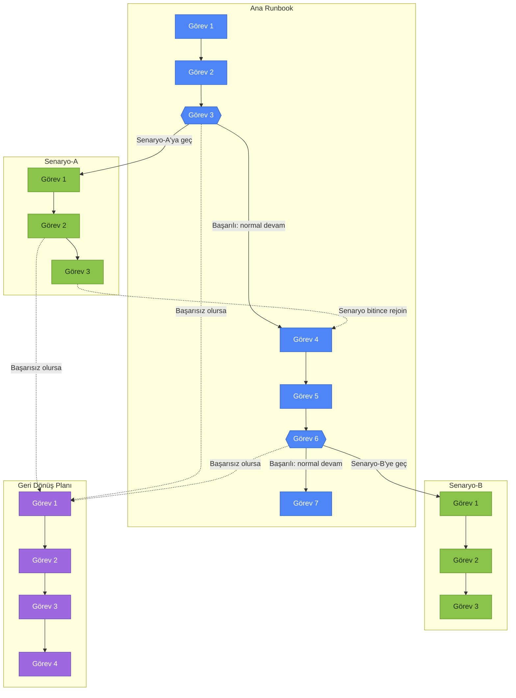
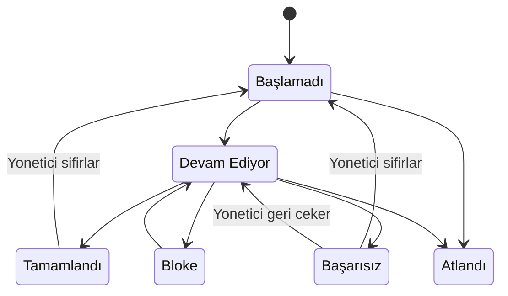
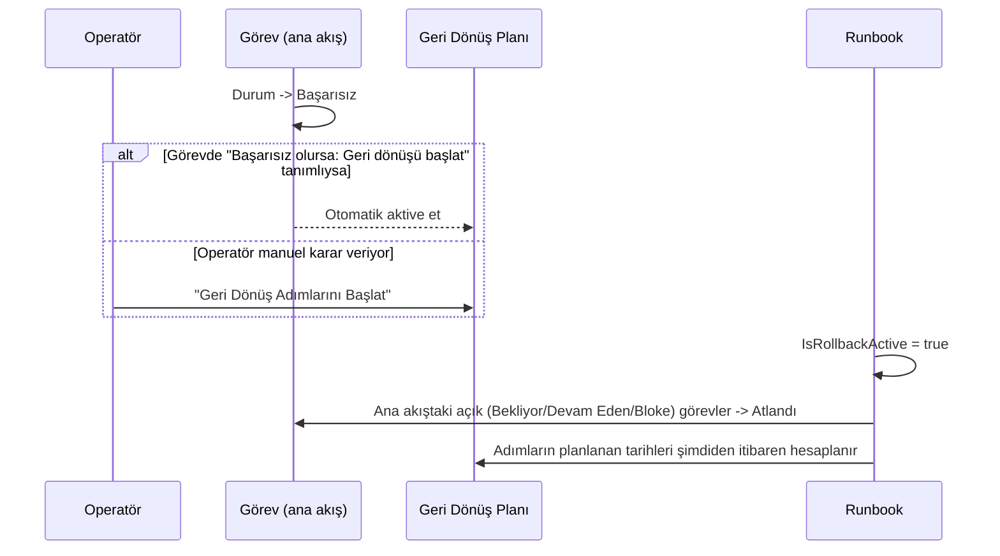
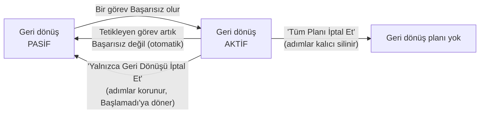
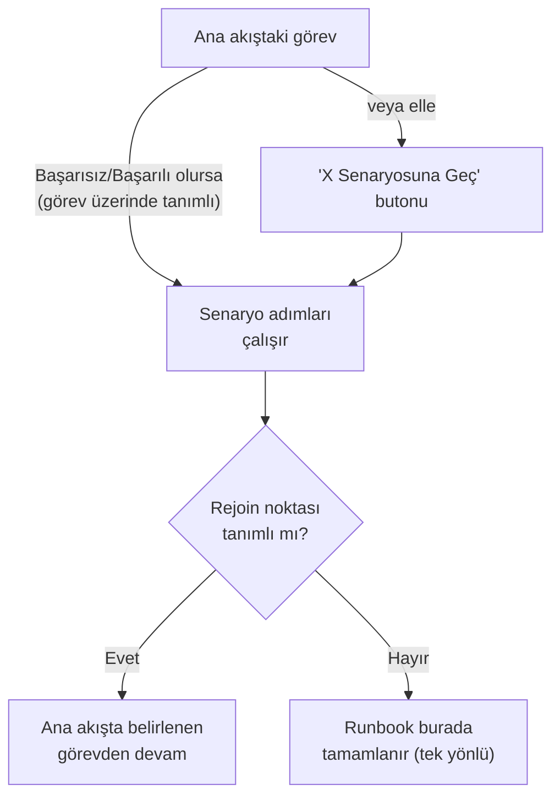

# Runbook, Görev, Geri Dönüş Planı ve Senaryo

Bu doküman BookRunner'daki dört temel kavramı ve aralarındaki ilişkiyi anlatır:
**Runbook**, **Görev (Task)**, **Geri Dönüş Planı (Rollback)** ve **Senaryo (Scenario)**.

## 1. Genel bakış

Bir Runbook, sırayla yürütülen **görevlerden** oluşan bir çalışma/geçiş planıdır
(örn. bir sistem geçişi, bir değişiklik operasyonu). Normal akış tek bir görev
listesi olarak baştan sona ilerler. Ama gerçek operasyonlarda iki türlü sapma
gerekir:

- Bir görev **başarısız** olursa, işi eski haline döndürmek için önceden
  hazırlanmış bir **Geri Dönüş Planı**na geçilebilir.
- Duruma göre (bir görevin sonucuna bağlı olarak) ana akıştan **farklı bir
  koldan** (Senaryo) devam edilebilir; senaryo bittiğinde ana akışa geri
  dönülebilir.

Aşağıdaki diyagram bu dördünün birbirine nasıl bağlandığını gösterir:

Kesikli oklar **otomatik tetiklenen** geçişleri (bir görevin sonucuna bağlı),
düz oklar ise **normal akışı / manuel geçişleri** gösterir.

---

## 2. Görev (Task)

Bir görev, runbook içindeki tek bir adımdır: başlık, sorumlu, planlanan
tarih/saat, öncül bağımlılıkları ve bir **durumu** vardır.

> Not: "N/A - Gerekmiyor" durumu yalnızca geri dönüş adımlarında kullanılır
> (geri dönüşün başladığı noktaya göre bazı adımlara ihtiyaç olmayabilir).

### Görev bazında otomatik tetikleme

Her görev, kendi **sonucuna** göre otomatik bir eylem tanımlayabilir - operatör
ayrıca bir butona basmak zorunda kalmaz:

| Sonuç | Tanımlanabilecek otomatik eylem |
|---|---|
| **Başarısız** olursa | Geri Dönüş Planını otomatik başlat, **veya** belirli bir senaryoya otomatik geç |
| **Tamamlandı** (başarılı) olursa | Belirli bir senaryoya otomatik geç |

Bu, "Görevi Düzenle" ekranında veya (senaryo için) senaryo adımı eklerken
"bağlı görev + koşul" seçilerek tanımlanır.

---

## 3. Geri Dönüş Planı (Rollback)

Geri dönüş adımları, ana gövde listesinde **gizli** duran, ayrı bir alt
listedir. Bir görev başarısız olduğunda (elle "Geri Dönüş Adımlarını Başlat"
butonuyla ya da görev üzerinde tanımlı otomatik eylemle) **aktive edilir**:

### Aktivasyon geri alınabilir

Tetikleyen koşul ortadan kalkarsa (örn. bir yönetici o görevi tekrar "Devam
Ediyor" veya "Başlamadı"ya çekerse ve akışta başka başarısız görev kalmazsa),
geri dönüş **otomatik olarak iptal edilir**. Ayrıca manuel iki iptal seçeneği
vardır:

---

## 4. Senaryo (Scenario)

Senaryolar, ana akıştan **koşullu olarak dallanan** alternatif adım
gruplarıdır (örn. "Senaryo-A", "Senaryo-B"). Bir görev üzerinde tanımlanan
"bağlı görev + koşul" (başarılı/başarısız) ile otomatik tetiklenebilir, ya da
elle "X Senaryosuna Geç" butonuyla başlatılabilir.

Önemli noktalar:

- Senaryo seçildiğinde, **rejoin noktasından önceki** açık ana akış görevleri
  otomatik "Atlandı" olur; rejoin noktası ve sonrasına dokunulmaz.
- Senaryo **tüm adımlarıyla** tamamlandığında:
  - Rejoin noktası tanımlıysa, runbook o görevden **otomatik devam eder**.
  - Tanımlı değilse, senaryo tek yönlüdür ve runbook orada sona erer.
- Bir senaryo adımı da başarısız olursa, kendi üzerinde tanımlıysa Geri Dönüş
  Planını tetikleyebilir (görev bazında otomatik eylem senaryo/ana akış
  ayrımı yapmaz).

---

## 5. Üç mekanizmanın karşılaştırması

| | Nasıl tetiklenir | Ana akışa etkisi | Geri dönüşü |
|---|---|---|---|
| **Geri Dönüş Planı** | Bir görev "Başarısız" olunca (otomatik veya elle) | Açık görevler "Atlandı" olur | Otomatik (tetikleyen koşul kalkınca) veya elle iptal edilebilir |
| **Senaryo** | Bir görev "Başarılı/Başarısız" olunca (otomatik veya elle) | Rejoin noktasına kadarki açık görevler "Atlandı" olur | Rejoin noktası tanımlıysa senaryo bitince otomatik; değilse tek yönlü |

---

*Bu doküman, BookRunner uygulamasının `claude/bookrunner-runbook-app-57f25r`
dalındaki geri dönüş planı ve senaryo dallanması özelliklerini anlatır.*
